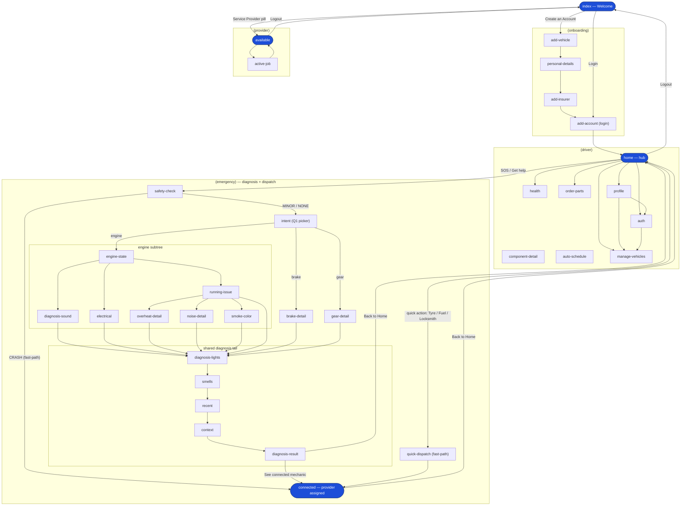
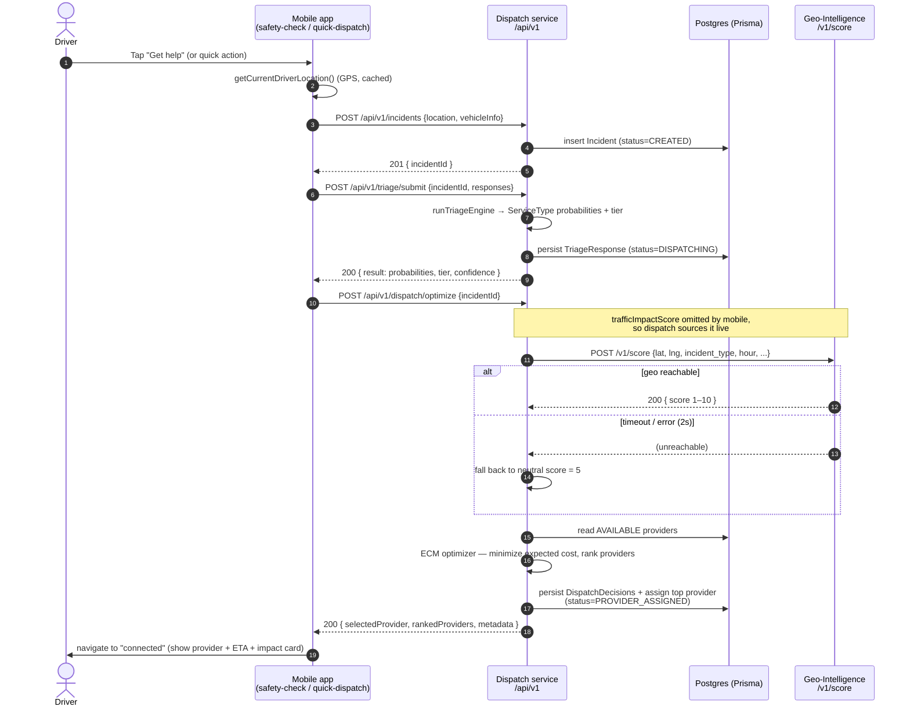
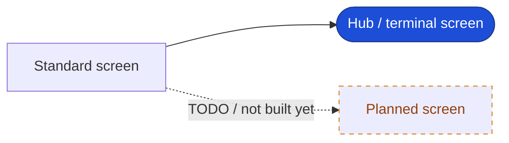

# Kaduna.lk — App & Dispatch Flows

> Living flow documentation. Edit the Mermaid blocks below and the diagrams
> re-render automatically on GitHub and in VS Code (see "How to edit" at the bottom).
> Keep this file as the single source of truth for navigation + the dispatch spine.

## 1. Screen navigation (Expo Router route groups)

## 2. Hero flow — mobile → dispatch → geo → provider (sequence)

> **Known limitation (G-004):** `geo-client.ts` sends static road geometry
> (`primary`, 2 lanes, 1 blocked) for every incident. Live scores reflect
> incident type and time-of-day but not OSM road class at GPS. Research CSVs
> use per-incident geometry. See `rp-analysis/gaps/remediation/R4-integration-test-spec.md`.

## 3. Legend & conventions (how to add / modify / mark)

**Conventions for this doc**

- **Node naming** — use the real route file name (e.g. `diagnosis-lights`), not a prose label, so a node maps 1:1 to a file in `apps/mobile/app/`.
- **Shapes** — `["..."]` = a screen; `(["..."])` = a hub or terminal screen (entry, home, connected, available); apply `class <node> hub` for the blue highlight.
- **Edges** — label every transition with the trigger that fires it: `home -->|SOS| safety`. Branches from one screen = multiple labelled edges out of that node.
- **Adding a screen** — (1) add the route file under the right `(group)/`, (2) add one node inside that group's `subgraph`, (3) add the labelled edge(s) for how you reach it. That's the whole change — one node + one edge line.
- **Marking work-in-progress** — use a dashed edge `-. "TODO" .->` and the `todo` class so unbuilt screens are visually distinct. Remove the dashes once the route exists.
- **Keep it strict** — do **not** add Mermaid `click` directives: GitHub renders with `securityLevel: 'strict'` and will silently drop them. Diagrams stay pure-visual.
- **Backend changes** — the dispatch spine lives in `components/dispatch/src/routes/*` and `services/geo-client.ts`; if an endpoint or the geo fallback changes, update the sequence diagram in section 2.

## How to edit & render

- **GitHub**: push this file — all three Mermaid blocks render inline in the file view and in any PR/issue. No build step, no images.
- **VS Code**: install **Markdown Preview Mermaid Support** (`bierner.markdown-mermaid`), open this file, `Ctrl/Cmd-Shift-V` for a live preview that updates as you type.
- **Scratch experiments**: paste a block into the Mermaid Live Editor (mermaid.live), then paste back.
- **Richer visuals later (optional)**: add `docs/<name>.drawio.svg`, edit with the **Draw.io Integration** extension (`hediet.vscode-drawio`); it shows as an image on GitHub while staying editable. Keep this file as the canonical flow source.
